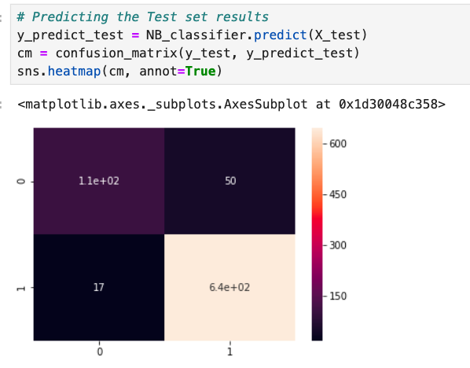

# Yelp Reviews Sentiment Analysis (NLP Project)

## Heatmap — Confusion Matrix Visualization

- The heatmap below shows the confusion matrix of the Naive Bayes model predicting 1-star vs 5-star reviews.

- The model correctly classified most reviews, especially 5-star ones.
- 47 positive reviews were misclassified as negative, and 28 negative reviews were misclassified as positive.
- This means that while the model is slightly more confident with positive (5-star) reviews, it still performs very well overall confirming the strong separation between negative and positive sentiment in text.
  
##  Project Overview
- This project applies Natural Language Processing (NLP) techniques to analyze 10,000 Yelp customer reviews and predict whether a review expresses a negative (1-star) or positive (5-star) opinion.
- The goal was to explore how much information about customer satisfaction can be extracted purely from the text, without relying on any other numerical or contextual data.

## Data Preprocessing
The dataset includes:
- text — the content of the review
- stars — business rating (1–5 scale)
- cool, useful, funny — number of reactions from other users
  
Steps performed:

- Removed punctuation and converted text to lowercase.
- Removed stop words (e.g., the, and, is).
- Tokenized the text into individual words.
- Transformed text into numerical features using CountVectorizer.

 ## Model & Evaluation
A Naive Bayes classifier was trained to distinguish between 1-star and 5-star reviews based only on their text content.
After training on approximately 10,000 reviews, the model achieved strong results:

A heatmap of the confusion matrix was generated to visualize the model’s performance and identify where misclassifications occurred.

## TF-IDF Experiment

The same model was retrained using TF-IDF vectorization instead of CountVectorizer.
However, the overall accuracy slightly decreased, indicating that simple word counts were more effective for this dataset.

## Libraries Used
- pandas — data manipulation and preprocessing
- numpy — numerical operations
- matplotlib, seaborn — data visualization (heatmaps, plots)
- scikit-learn — NLP vectorization and model evaluation
  
## Summary
- Dataset: 10,000 Yelp reviews
- Goal: Predict if a review is 1-star (negative) or 5-star (positive) using only its text
- Model: Multinomial Naive Bayes
- Accuracy: ≈92% with CountVectorizer
- TF-IDF results were slightly lower
- The project demonstrates how basic NLP preprocessing and probabilistic models can effectively classify sentiment in large-scale review data
